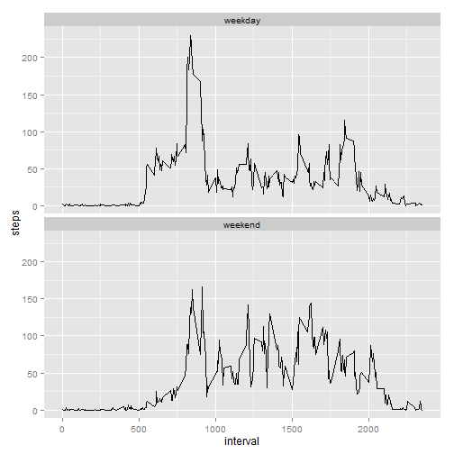

## Loading and preprocessing the data

It is assumed that the activity data resides in location **activity/activity.csv** under the current directory.

```r
data <- read.csv("activity/activity.csv")
str(data)
```

```
## 'data.frame':	17568 obs. of  3 variables:
##  $ steps   : int  NA NA NA NA NA NA NA NA NA NA ...
##  $ date    : Factor w/ 61 levels "2012-10-01","2012-10-02",..: 1 1 1 1 1 1 1 1 1 1 ...
##  $ interval: int  0 5 10 15 20 25 30 35 40 45 ...
```
The steps variable has missing values in some rows. so we clean it.

```r
cleanData <- data[!is.na(data$steps),]
str(cleanData)
```

```
## 'data.frame':	15264 obs. of  3 variables:
##  $ steps   : int  0 0 0 0 0 0 0 0 0 0 ...
##  $ date    : Factor w/ 61 levels "2012-10-01","2012-10-02",..: 2 2 2 2 2 2 2 2 2 2 ...
##  $ interval: int  0 5 10 15 20 25 30 35 40 45 ...
```


## What is mean total number of steps taken per day?
The number of steps taken in day are represented in the histogram below.


```r
library(ggplot2)
subData <- cleanData[,c("date", "steps")]
aggregatedData <- aggregate(subData$steps, by = list(subData$date), FUN=sum)
names(aggregatedData)[names(aggregatedData) == "x"] <- "steps"
ggplot(aggregatedData, aes(steps)) + geom_histogram(color="black")
```

```
## stat_bin: binwidth defaulted to range/30. Use 'binwidth = x' to adjust this.
```

 

The mean and median number of daily steps are given below

```r
mean(aggregatedData$steps)
```

```
## [1] 10766.19
```

```r
median(aggregatedData$steps)
```

```
## [1] 10765
```


## What is the average daily activity pattern?

The number of steps for any 5-minute interval averaged across all days is given below.

```r
subData <- cleanData[,c("interval", "steps")]
aggregatedData <- aggregate(subData, by = list(subData$interval), FUN=mean)
ggplot(aggregatedData, aes(interval, steps)) + geom_line(color="black")
```

 

The interval with the maximum number of steps (averaged across all days) is given below

```r
maxStep <- max(aggregatedData$steps)
aggregatedData[aggregatedData$steps == maxStep,]
```

```
##     Group.1 interval    steps
## 104     835      835 206.1698
```

## Imputing missing values

Total number of missing values in the dataset is given below.

```r
missingData <- data[is.na(data$steps),]
nrow(missingData)
```

```
## [1] 2304
```

We use the average number of steps for the corresponding interval to impute the missing data.

```r
missingData <- missingData[,c("interval", "date")]
imputedData <- merge(missingData, aggregatedData, by = "interval")
imputedData <- imputedData[,c("steps", "interval", "date")]
mergedData <- rbind(cleanData, imputedData)
str(mergedData)
```

```
## 'data.frame':	17568 obs. of  3 variables:
##  $ steps   : num  0 0 0 0 0 0 0 0 0 0 ...
##  $ date    : Factor w/ 61 levels "2012-10-01","2012-10-02",..: 2 2 2 2 2 2 2 2 2 2 ...
##  $ interval: int  0 5 10 15 20 25 30 35 40 45 ...
```

```r
rm(data)
rm(cleanData)
rm(imputedData)
```

We calculate a new histogram of daily number of steps and mean and median.

```r
subData <- mergedData[,c("date", "steps")]
attach(subData)
aggregatedData <- aggregate(subData$steps, by = list(date), FUN=sum)
names(aggregatedData)[names(aggregatedData) == "x"] <- "steps"
ggplot(aggregatedData, aes(steps)) + geom_histogram(color="black")
```

```
## stat_bin: binwidth defaulted to range/30. Use 'binwidth = x' to adjust this.
```

 

The mean and median number of daily steps are given below

```r
mean(aggregatedData$steps)
```

```
## [1] 10766.19
```

```r
median(aggregatedData$steps)
```

```
## [1] 10766.19
```

We see that after imputation, mean remains the same, while median increased slightly.

## Are there differences in activity patterns between weekdays and weekends?

We add a factor ("weekday", "weekend") to the imputed data set, aggregate the data and plot it.

```r
mergedData$date <- as.Date(mergedData$date)
mergedData$day <- weekdays(mergedData$date, abbreviate=TRUE)
dayMap <- data.frame(day = c("Mon", "Tue", "Wed", "Thu", "Fri", "Sat", "Sun"), daytype = c(rep("weekday", 5), rep("weekend", 2)))
mergedData <- merge(mergedData, dayMap, by = "day")
mergedData <- mergedData[,c("steps", "interval", "daytype")]
mergedData$daytype <- as.factor(mergedData$daytype)
aggregatedData <- aggregate(mergedData$steps, by = list(mergedData$daytype, mergedData$interval), FUN=mean)
names(aggregatedData)[names(aggregatedData) == "Group.1"] <- "daytype"
names(aggregatedData)[names(aggregatedData) == "Group.2"] <- "interval"
names(aggregatedData)[names(aggregatedData) == "x"] <- "steps"
str(aggregatedData)
```

```
## 'data.frame':	576 obs. of  3 variables:
##  $ daytype : Factor w/ 2 levels "weekday","weekend": 1 2 1 2 1 2 1 2 1 2 ...
##  $ interval: int  0 0 5 5 10 10 15 15 20 20 ...
##  $ steps   : num  2.2512 0.2146 0.4453 0.0425 0.1732 ...
```

```r
ggplot(aggregatedData, aes(interval, steps)) + geom_line(color="black") + facet_wrap(~daytype, nrow = 2)
```

 
